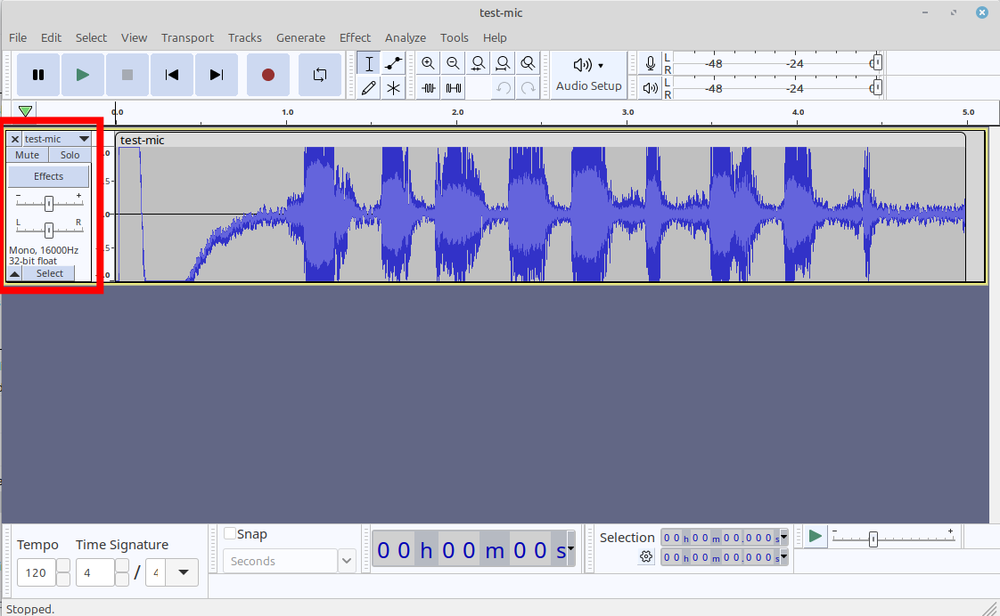

Главное: ЗАПУСТИТЬ

````shell
docker run -d -p 2700:2700 alphacep/kaldi-ru:latest
````
Файл wav должен быть с параметрами Mono, 16kHz, 32 bit float 



Распознавание:

````shell
python3 ./test.py mishka.wav > miska_out.txt
````

Результат смотреть в конце файла miska_out.txt.
Это JSON. Результат по JSON PATH ./text .

````text
"text" : "дайте мне конфет мишка на севере триста грамм"
````